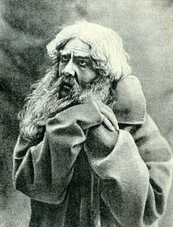

# Susanin
 [  ](https://bintray.com/dokwork/maven/susanin/_latestVersion)
[](https://travis-ci.org/dokwork/susanin)
[](https://coveralls.io/github/dokwork/susanin?branch=master)



This library provides an API to trace your Scala code. It is compatible with
[opentracing-java](https://github.com/opentracing/opentracing-java/) and is mostly built with 
`opentracing-java` wrap classes. Its important difference is the interface of `io.opentracing.Tracer` 
replaced by custom tagless final version of `ru.dokwork.susanin.Tracer` with a special method 
to run your function in terms of `F` inside the span:
```scala
val tracer: Tracer[F] = ???
def f(span: Span): F[A] = ???
val result: F[A] = tracer.newSpan("test")(f)
```
 
## Installation
 
 `libraryDependencies += "ru.dokwork" %% "susanin" % "0.1.0"`
 
# How to use
 
 The heart of this library is the `concurrent` package which contains instrumented versions of the
 `ExecutionContext`, `ExecutorService` and `TraceableScheduledExecutorService`.
 
 **IMPORTANT:** you *must* wrap _each_ of your `ExecutionContext`s by the `TraceableExecutionContext`.
 Otherwise the graph of final spans will be misleading!
 
 to be continued...
